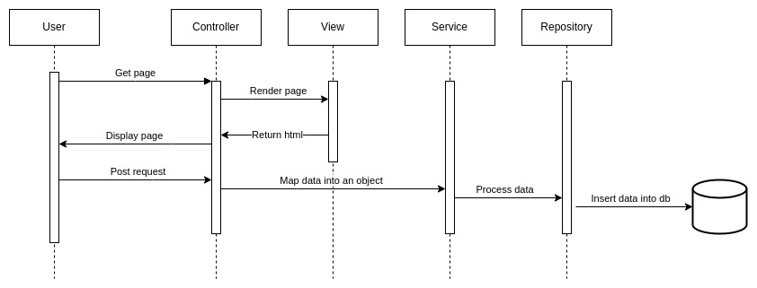

# Spring Boot application

Code School is an application to learn how Spring Boot works and how to create applications using it.

All the backend is made from the ground up, the frontend was already done (link in index.hmtl file).

We focus the build of the app using Domain Driven Design. A simple flow looks like this

### Notes
- DB is temporary and won't be available, in order to use one I recommend to create your own. The schema and initial data are included inside the `resources` folder.